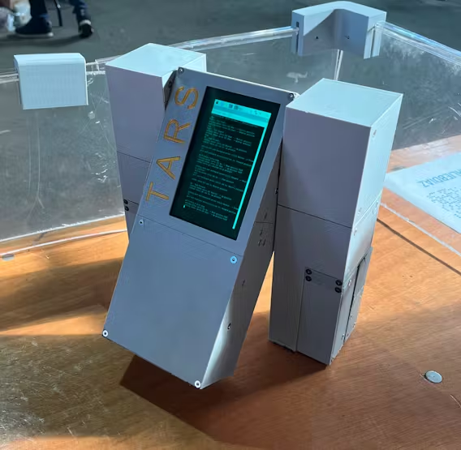

### miniTars power by gpt

#### example

#### hardware

* Raspberry Pi 3 Model B
* myCharge Hub Mini 3350mAh/2.4A bank
* LiPo Battery (3 cell, 11.1V, 1300mAh)
* 12V to 6V DC Buck Converter
* Adafruit 16-Channel PWM Servo Driver
* Elecrow 5" HDMI Display
* 8Bitdo Zero 2 Bluetooth Remote
* SG90 Micro-servo motor  [x4]
* Metal Gear "Standard" Servo [x5]
* Machine Screw, M3
* Lightweight Actobotics Servo Horn (H25T Spline)

#### system 

* Raspberry Pi Raspbian

#### TARS 3 Main CAD

* [CAD 3D Print Model](tars_3_v9_tvCxpHViUu.step)

#### Code 

* Servo Abstractor
>Sort of redundant to give these functions their own file, but this program takes the basic servo movements from the servo controller file and combines them to automate walking functions.

* TARS Runner
>Run this file in terminal on your onboard computer to initialize TARS. This file handles communication with the bluetooth remote.

* Servo Controller
> Handles basic movements of servos in TARS. Communicates with an Adafruit PCA9685 servo driver to control the servos.

#### TODO

* Add GPT
* Speak

#### Link 

* [hackster literary works](https://www.hackster.io/charlesdiaz/how-to-build-your-own-replica-of-tars-from-interstellar-224833)

